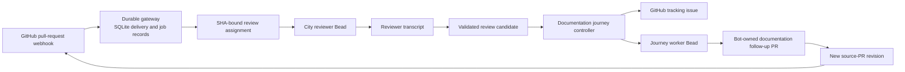
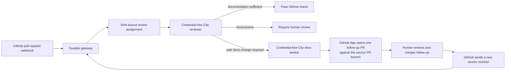
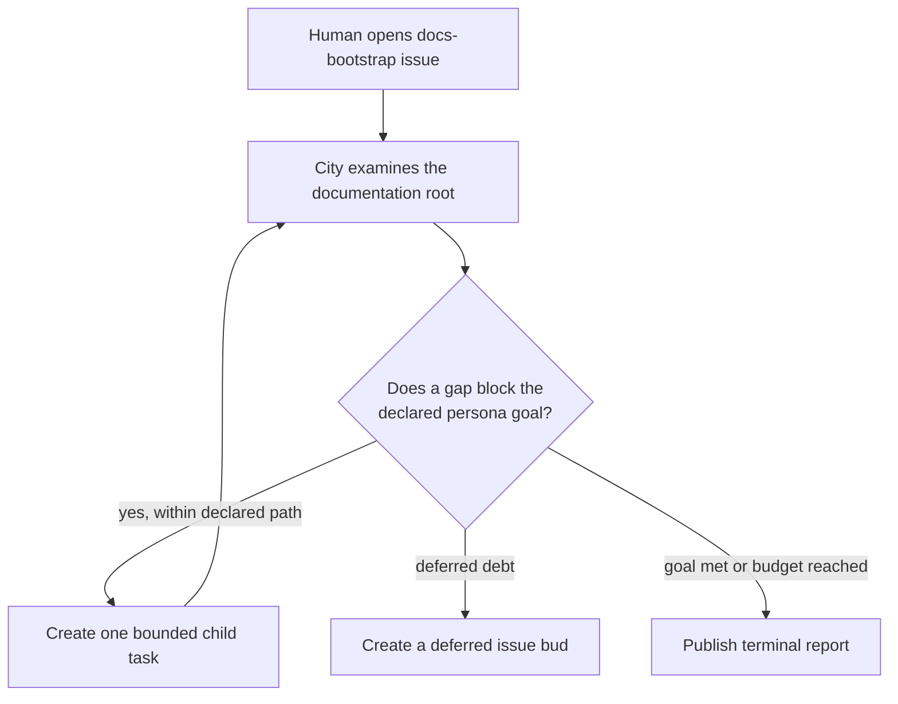

# GitHub docs-impact architecture

Use this page to understand the GitHub pull-request documentation gate in the
`github-docs-impact` Compose profile. The profile is branch-only work until
the accompanying pull request merges; it is not a published Gas City feature.

## What the gate is meant to do

For each pull-request revision, the gate should reach one of three outcomes:

- pass when the existing documentation is sufficient;
- require human review when evidence is inconclusive; or
- open one bot-owned documentation follow-up pull request against the source
  pull-request branch when a safe documentation change is needed.

Merging that follow-up creates a new revision of the source pull request. The
GitHub App receives that revision and evaluates it again.

## Current implementation

The current implementation makes every handoff durable so that restarting the
City does not lose a signed GitHub delivery. The diagram shows the components
and the evidence each handoff persists.

The reviewer receives the SHA-bound assignment but no GitHub credential. The
gateway verifies the reviewer result before using the GitHub App to publish a
Check Run or a follow-up pull request.

## Target PR-reactive path

The `GitHub tracking issue` and `Journey worker Bead` are useful for explicit
bootstrap or backfill work. They add unnecessary state to a pull-request gate:
the reviewer has already established that the source revision needs a
documentation change. The intended narrower path is:

The terminal state for the original source pull request is therefore visible
on GitHub: pass, action required, or a link to its single follow-up PR. The
human should not need to inspect gateway state, City Beads, or an internal
admin page on the normal path.

## Separate bootstrap and backfill mode

Bootstrap starts from an explicit issue, not from every pull-request event.
It may explore a documentation root, create bounded child work, and leave
deferred gap issues for later. Those issue buds are intentionally not an
automatic trigger for another recursive run.

This mode shares the technical-documentation and issue-driven-development
skills with the pull-request gate, but it has different entry and terminal
conditions.
