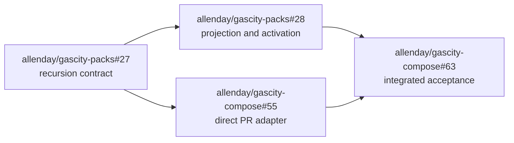

# Single documentation recursion implementation plan

> **For agentic workers:** REQUIRED SUB-SKILL: Use `superpowers:subagent-driven-development` (recommended) or `superpowers:executing-plans` to implement this plan task-by-task. Steps use checkbox (`- [ ]`) syntax for tracking.

**Goal:** Replace the special-case documentation journey controller with one recursion that records every affected documentation cell and projects checks, bot follow-up pull requests, and inert deferred issues.

**Architecture:** `gascity-packs` owns the versioned recursion record, its guarded admission/activation transitions, and GitHub/City projections. `gascity-compose` retains the signed durable gateway and turns a SHA-bound PR decision directly into one credential-free City docs worker, then lets the GitHub App publish the worker's validated follow-up. GitHub is the human-visible record; the City execution graph remains internal.

**Tech Stack:** Python 3.14, GitHub App REST client, Gas City Beads/formulas, Docker Compose, `unittest`, GitHub Actions.

**Spec:** `docs/superpowers/specs/2026-09-04-single-docs-recursion-design.md`

## Global constraints

- Every incoming context is `github-pull-request`, `github-issue`, or `operator-request`; no context receives a special workflow.
- Persist an immutable context and declared coverage collection of persona, goal, and documentation-type cells before a worker or GitHub projection.
- A PR context permits at most one child and one bot-owned follow-up PR, targeted to the reviewed source branch.
- Every uncovered affected cell is an inert, idempotently projected GitHub issue. It cannot create a Bead, worker, branch, PR, or descendant until explicit human activation supplies a new context.
- Buds do not consume any execution budget. On replay, create the issue only once and append current source/evidence to the existing issue instead.
- Preserve durable gateway delivery identity, SHA binding, retry/reconciliation, credential-free City workers, and GitHub App-only publishing.
- Keep v1/v2 stored journey records readable and adopt their existing external resources until terminal; new writes use only the recursion contract.
- No author-branch mutation, direct main write, automatic merge, or hand-rolled secret scanner.

## Delivery graph



---

### Task 1: Normalize the reusable recursion contract

**Issue:** `allenday/gascity-packs#27`

**Files:**

- Modify: `github/scripts/github_docs_journey.py`
- Modify: `github/scripts/github_intake_docs_journey_commands.py`
- Modify: `github/tests/test_github_docs_bootstrap.py`
- Modify: `github/tests/test_github_docs_journey_commands.py`
- Modify: `github/docs/docs-pr-review-lifecycle.md`
- Modify: `github/README.md`

**Interfaces:**

- Consumes: validated `github-pr-docs-impact-review` artifact and a normalized incoming context.
- Produces: persisted recursion record with `identity`, `context`, `coverage_cells`, `execution_budgets`, `children`, `buds`, `actions`, and `state`.
- Produces: commands `start-or-admit`, `activate-bud`, `record-child-update`, and `project-until-settled`.

- [ ] **Step 1: Write failing contract tests.**

  Add fixtures for all three context kinds. Assert identical record shape and state transitions for a path-blocking cell. Add a multi-cell test where a worker covers one cell and every uncovered cell creates a bud action but no child action. Add a test that `activate-bud` accepts only the recorded bud identity and a new explicit context.

- [ ] **Step 2: Run the focused Pack tests and verify the expected failure.**

  Run:

  ```bash
  python3 -m unittest github.tests.test_github_docs_bootstrap github.tests.test_github_docs_journey_commands -v
  ```

  Expected: failures because the record lacks normalized `context` and `coverage_cells`, cannot record each uncovered cell, and has no guarded bud-activation command.

- [ ] **Step 3: Implement the minimal versioned recursion record and transitions.**

  Add a single normalization function that validates the context, coverage cells, and execution budgets. Record a result for every cell: sufficient, covered by active work, or bud-recorded. Bud creation must not decrement or be capped by execution budgets. Make bud activation construct a fresh record; it must never mutate an old bud into executable work. Retain read/adoption paths for legacy stored data without emitting legacy fields in newly created records.

- [ ] **Step 4: Re-run focused tests and then the Pack GitHub suite.**

  Run:

  ```bash
  python3 -m unittest github.tests.test_github_docs_bootstrap github.tests.test_github_docs_journey_commands -v
  python3 -m unittest discover -s github/tests -v
  ```

  Expected: all tests pass, including replay, stale-snapshot, duplicate-admission, active-work budget, unlimited bud, and inert-bud cases.

- [ ] **Step 5: Commit the Pack contract change.**

  ```bash
  git add github/scripts/github_docs_journey.py github/scripts/github_intake_docs_journey_commands.py github/tests/test_github_docs_bootstrap.py github/tests/test_github_docs_journey_commands.py github/docs/docs-pr-review-lifecycle.md github/README.md
  git commit -m "feat(github): normalize documentation recursion contract"
  ```

### Task 2: Project bounded work and inert buds through GitHub and City

**Issue:** `allenday/gascity-packs#28`

**Files:**

- Modify: `github/scripts/github_docs_journey.py`
- Modify: `github/scripts/github_intake_docs_journey_complete.py`
- Modify: `github/formulas/github-docs-journey.formula.toml`
- Modify: `github/agents/docs-journey/prompt.template.md`
- Modify: `github/tests/test_github_docs_journey_formula.py`
- Modify: `github/tests/test_github_docs_bootstrap_smoke.py`

**Interfaces:**

- Consumes: Task 1's `child-admitted` or `bud-recorded` action.
- Produces: at most one City Bead and one bot-owned PR for an admitted child; exactly one idempotent GitHub issue for every unresolved coverage cell.
- Produces: human-readable issue body headed by the persona-goal-doc-type cell, with provenance retained in logical markers/metadata and current evidence appended on replay.

- [ ] **Step 1: Write failing projection tests.**

  Assert an admitted PR-context child creates no GitHub tracking issue before it has a worker result. Assert every unresolved cell creates one GitHub issue containing its persona-goal-doc-type cell and creates no Bead/PR. Assert a duplicate projection adopts the existing issue and appends current evidence rather than creating another. Assert an activation of that issue is the only route that creates a new work item.

- [ ] **Step 2: Run focused projection tests and verify the expected failure.**

  Run:

  ```bash
  python3 -m unittest github.tests.test_github_docs_journey_formula github.tests.test_github_docs_bootstrap_smoke -v
  ```

  Expected: the current controller creates a tracking issue/Bead for a PR gap and lacks the explicit activation path.

- [ ] **Step 3: Implement projection rules and worker contract.**

  Keep the controller as the only GitHub publisher. For PR context, project a direct City child from the immutable reviewed SHA and publish its validated branch as one follow-up PR. For every unresolved cell, create or update only the idempotent GitHub issue. Update the worker prompt to return a branch/commit/evidence result; it never opens or merges a PR. Add the explicit activation command/label handling that creates a new normalized context.

- [ ] **Step 4: Run focused and full Pack tests.**

  Run:

  ```bash
  python3 -m unittest github.tests.test_github_docs_journey_formula github.tests.test_github_docs_bootstrap_smoke -v
  python3 -m unittest discover -s github/tests -v
  ```

  Expected: all tests pass; PR path has one follow-up maximum, every unresolved cell has one observable issue, and those issues remain non-executing until activation.

- [ ] **Step 5: Commit the Pack projection change.**

  ```bash
  git add github/scripts/github_docs_journey.py github/scripts/github_intake_docs_journey_complete.py github/formulas/github-docs-journey.formula.toml github/agents/docs-journey/prompt.template.md github/tests/test_github_docs_journey_formula.py github/tests/test_github_docs_bootstrap_smoke.py
  git commit -m "feat(github): project bounded documentation recursion"
  ```

### Task 3: Simplify the Compose PR adapter to direct bounded work

**Issue:** `allenday/gascity-compose#55`

**Files:**

- Modify: `scripts/github_docs_impact_compose_adapter.py`
- Modify: `scripts/github_docs_impact_city_dispatcher.py`
- Modify: `compose.yaml`
- Modify: `.env.example`
- Modify: `scripts/tests/test_github_docs_impact_compose_adapter.py`
- Modify: `scripts/tests/test_github_durable_gateway.py`
- Modify: `scripts/tests/test_github_docs_impact.sh`

**Interfaces:**

- Consumes: a SHA-bound `docs-change-required` candidate and Task 2's direct-child contract.
- Produces: one durable direct-child dispatch marker keyed by the candidate digest and one validated worker result for the App publisher.
- Removes: PR-path use of `GC_CITY_DOCS_JOURNEY_TARGET`, `journey-dispatch`, and generic controller command invocations.

- [ ] **Step 1: Write failing Compose tests.**

  Add a test that a PR `docs-change-required` candidate persists one direct-child request and does not invoke `github_intake_docs_journey_commands.py`, create a relay-only GitHub tracking issue, or write a `journey-dispatch` marker. Add a replay test proving the same candidate yields the same direct child and no duplicate follow-up intent.

- [ ] **Step 2: Run the focused Compose test and verify the expected failure.**

  Run:

  ```bash
  python3 -m unittest scripts.tests.test_github_docs_impact_compose_adapter -v
  ```

  Expected: current assertions expose generic journey command invocation and the extra controller handoff.

- [ ] **Step 3: Implement direct PR child persistence, dispatch, and harvesting.**

  Replace `_admit_docs_journey` and the journey-only dispatcher methods with a direct-child marker that echoes candidate identity, source key, SHA, coverage cells, and bounded active-work budget. Dispatch only that persisted marker from the City-local process. Reuse Task 2's result validation and publisher contract; do not grant GitHub credentials to the City worker. Remove Compose environment and profile requirements that exist solely for the old controller path.

- [ ] **Step 4: Run Compose unit, durable-gateway, and profile checks.**

  Run:

  ```bash
  python3 -m unittest scripts.tests.test_github_docs_impact_compose_adapter scripts.tests.test_github_durable_gateway -v
  docker compose --env-file /root/src/gascity-compose/.env -f compose.yaml --profile github-docs-impact config --quiet
  ```

  Expected: all tests pass and the profile renders without the removed journey-target configuration.

- [ ] **Step 5: Commit the Compose adapter change.**

  ```bash
  git add scripts/github_docs_impact_compose_adapter.py scripts/github_docs_impact_city_dispatcher.py compose.yaml .env.example scripts/tests/test_github_docs_impact_compose_adapter.py scripts/tests/test_github_durable_gateway.py scripts/tests/test_github_docs_impact.sh
  git commit -m "refactor: dispatch docs impact through one recursion"
  ```

### Task 4: Integrate, document, and dogfood the full recursion

**Issue:** `allenday/gascity-compose#63`

**Files:**

- Modify: `docs/github-docs-impact-architecture.md`
- Modify: `README.md`
- Modify: `scripts/tests/test_github_docs_impact.sh`
- Modify: `docs/superpowers/specs/2026-09-04-single-docs-recursion-design.md` only if implementation reveals a genuine design amendment

**Interfaces:**

- Consumes: Task 2 Pack projection and Task 3 Compose direct PR adapter.
- Produces: one rendered GitHub-facing architecture diagram and an end-to-end smoke proof for sufficient, human-review, follow-up, and inert-bud paths.

- [ ] **Step 1: Write failing end-to-end fixture assertions.**

  Extend the smoke fixture to assert four externally visible outcomes: documentation sufficient passes; an inconclusive result requires human review; a safe PR gap creates one stacked bot follow-up with the original check pending; every uncovered cell creates or updates one issue and no execution artifact until an explicit activation fixture is supplied.

- [ ] **Step 2: Run the smoke test and verify the expected failure.**

  Run:

  ```bash
  bash scripts/tests/test_github_docs_impact.sh
  ```

  Expected: current architecture wording and fixture expectations still describe the removed controller path.

- [ ] **Step 3: Update the human-facing architecture.**

  Replace separate-mode diagrams and wording with the rendered single-recursion design. Describe GitHub checks, follow-up PRs, and inert issues as projections; do not tell an operator to inspect City internals for normal operation.

- [ ] **Step 4: Run complete local verification and live dogfood.**

  Run:

  ```bash
  python3 -m unittest scripts.tests.test_github_docs_impact_compose_adapter scripts.tests.test_github_durable_gateway -v
  bash scripts/tests/test_github_docs_impact.sh
  docker compose --env-file /root/src/gascity-compose/.env -f compose.yaml --profile github-docs-impact config --quiet
  ```

  Then create a disposable PR in `allenday/gascity-compose` with a real, small changed interface. Verify in GitHub that the direct follow-up targets the source branch, merging it emits a new source SHA, and the next docs-impact check reflects that SHA. Capture immutable PR/check URLs in the IDD acceptance event.

- [ ] **Step 5: Commit documentation and acceptance fixtures.**

  ```bash
  git add docs/github-docs-impact-architecture.md README.md scripts/tests/test_github_docs_impact.sh docs/superpowers/specs/2026-09-04-single-docs-recursion-design.md
  git commit -m "docs: describe single documentation recursion"
  ```

## Plan self-review

- Spec coverage: Tasks 1–2 implement the one-recursion, full-coverage, and non-costing inert-bud rules; Task 3 removes the PR-only controller hop while retaining durable gateway boundaries; Task 4 validates and documents every external projection.
- Dependency coverage: Task 2 and Task 3 may begin after Task 1 exposes its interface, but Task 4 cannot enter final critique until both are complete.
- Placeholder scan: every task names exact files, inputs/outputs, failing tests, expected failure, verification commands, and commit scope.
