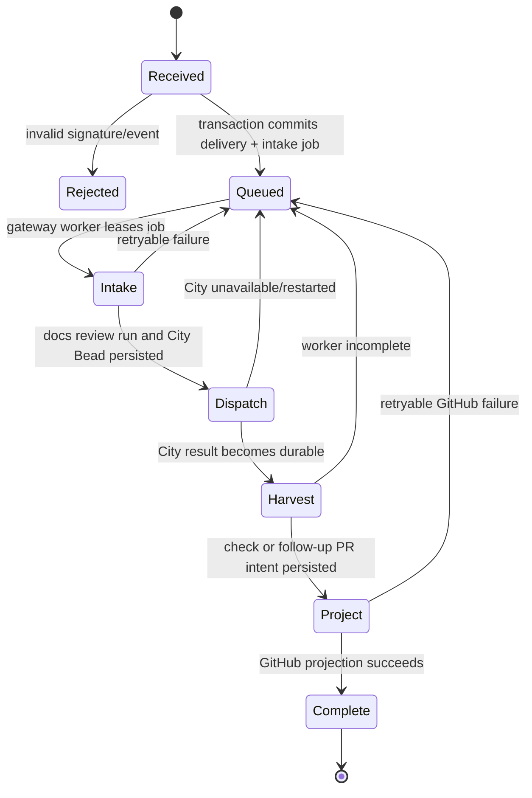

# Durable GitHub Gateway Design

## Goal

Make GitHub delivery acceptance independent of the City process so a City
restart cannot lose an accepted pull-request event or strand its docs-impact
lifecycle.

## Boundary

This is Compose deployment infrastructure. `gascity-packs` remains
source-neutral: it supplies the docs-impact and docs-journey contracts, but
does not own an HTTP listener, SQLite database, Compose topology, or GitHub
App lifecycle worker.

The Compose profile replaces the present coupled webhook/runtime processes with
one independently networked `github-gateway` service. It does not use
`network_mode: service:city`. Nginx remains the only public ingress point.

## Durable model

`state/github-intake/gateway.sqlite` is the gateway's only new persistence
artifact and is mounted from the existing host state directory. Python's
standard `sqlite3` module is sufficient; no broker, cache, or additional
container is introduced.

The database contains:

| Table | Durable key | Purpose |
| --- | --- | --- |
| `deliveries` | GitHub delivery UUID | verified raw body, event type, receipt time, and deduplication record |
| `jobs` | `(delivery_id, kind)` | idempotent lifecycle work: `intake`, `dispatch`, `harvest`, `project` |

The webhook verifies the signature and event filter, then commits the delivery
and its `intake` job in one SQLite transaction before returning `202`. A
duplicate delivery is acknowledged without adding work. A malformed or
unverified delivery never reaches SQLite.

## Control flow

Each job claim is a short SQLite lease. On gateway restart, expired leases are
made runnable again. City restart is not a gateway restart and only makes the
current `dispatch` or `harvest` attempt retryable. The gateway never invents a
new docs-impact decision or worker result; it continues using the existing
durable review and journey records.

## Interfaces and safety

- The HTTP handler accepts only signed `pull_request` actions already in the
  current allow-list.
- The worker invokes the existing Compose intake/reconciliation adapters using
  the persisted payload, not request memory.
- GitHub Check/PR writes remain idempotent through existing source keys and
  logical IDs.
- A job transitions to a terminal failure only for an input-validation error;
  network, City, and GitHub availability errors are retried with bounded
  backoff.
- Gateway status exposes queue depth and oldest runnable job for the existing
  health/status surface; no external dashboard is required.

## Tests and acceptance

1. A valid signed delivery persists before `202`; replaying its UUID creates
   one delivery and one intake job.
2. Stop and recreate City after the gateway has accepted a delivery. Restart
   City only; the gateway remains running and eventually dispatches the same
   job.
3. Stop and restart the gateway with a leased job. The expired lease is
   reclaimed and produces no duplicate Check Run, Bead, or GitHub PR.
4. Dogfood a `docs-change-required` PR. The city creates a docs branch and
   follow-up PR targeting the source PR branch; merging it causes the source
   PR's fresh docs-impact check to pass.

## Non-goals

- No Redis, NATS, Postgres, or separate queue product.
- No pack-level deployment abstraction or upstream Compose proposal yet.
- No attempt to repair historic stranded runs automatically; explicit replay is
  sufficient for the development environment.
