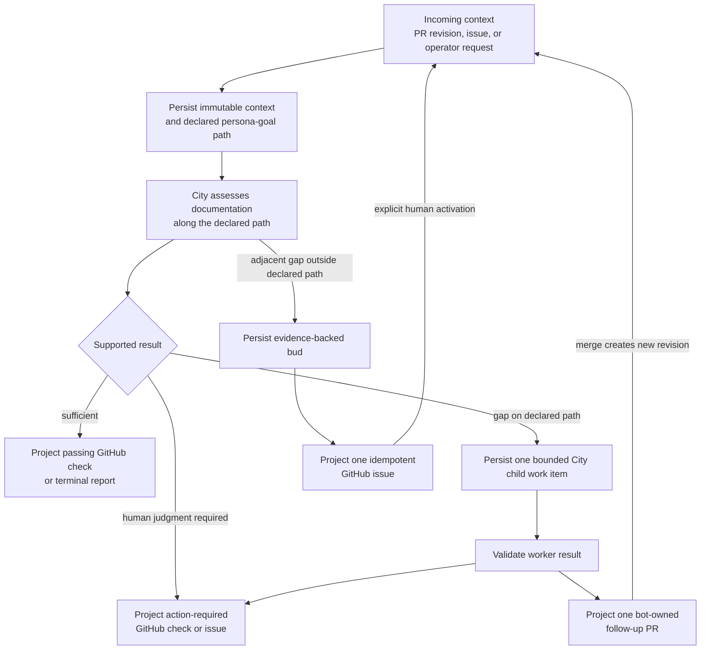
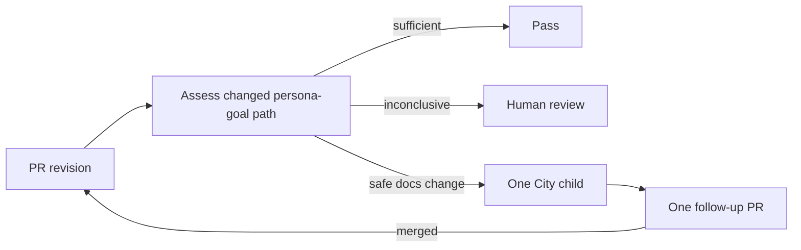

# Single documentation recursion design

## Goal

Use one bounded documentation recursion for every incoming context. A pull
request, a GitHub issue, and an explicit operator request differ only in the
context and budgets supplied to that recursion.

The City is a dark factory. GitHub is the human-facing record of what the
recursion found and what it did: checks, follow-up pull requests, and deferred
issues.

## Proposed flow

## Rules

- Every run has one immutable incoming context and a declared persona-goal
  path.
- Traversal may create work only when the evidence shows a gap on that path.
- Each run has explicit limits for depth, child work items, elapsed time, and
  non-progress.
- A gap outside the declared path becomes an evidence-backed bud. The App
  projects the bud as one GitHub issue for human observability.
- A bud is inert. Creating its issue does not start another run. A human
  activates it through an explicit policy, such as an assigned label or a
  command comment; that activation supplies a new incoming context.
- A follow-up pull request is also a projection, not a separate workflow.
  Merging it supplies a new pull-request revision and starts the next bounded
  traversal.

## PR context budgets

A pull-request revision is expected to be shallow, but it uses the same
recursion. Its default policy permits one documentation child and one
follow-up pull request. It does not automatically activate any issue buds.

## Refactor boundary

The Compose integration should retain the signed durable gateway, SHA-bound
assessment, credential-free City workers, and GitHub App publisher.

It should remove the generic documentation-journey controller from the
pull-request path. In particular, the pull-request path must not create a
GitHub issue and a second Bead merely to dispatch the child work already
identified by the assessment.

The recursion record is the only lifecycle authority. City Beads are its
execution detail; GitHub issues and pull requests are its human-visible
projections.
